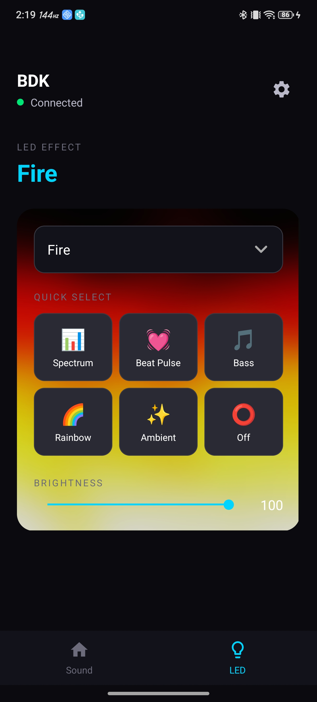
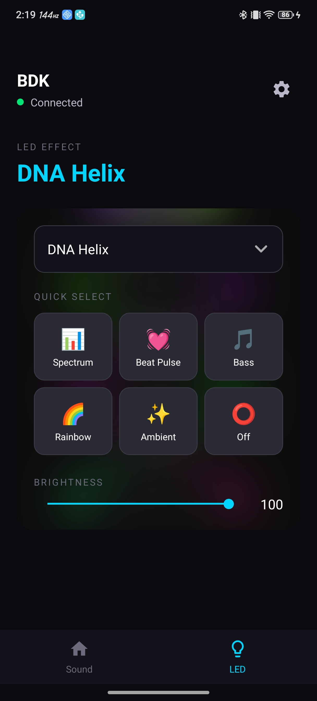
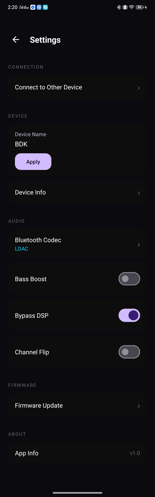
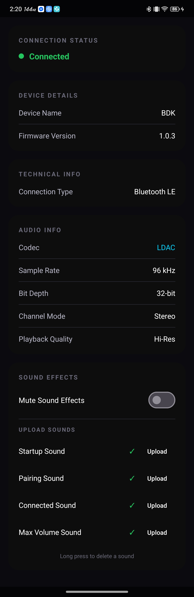
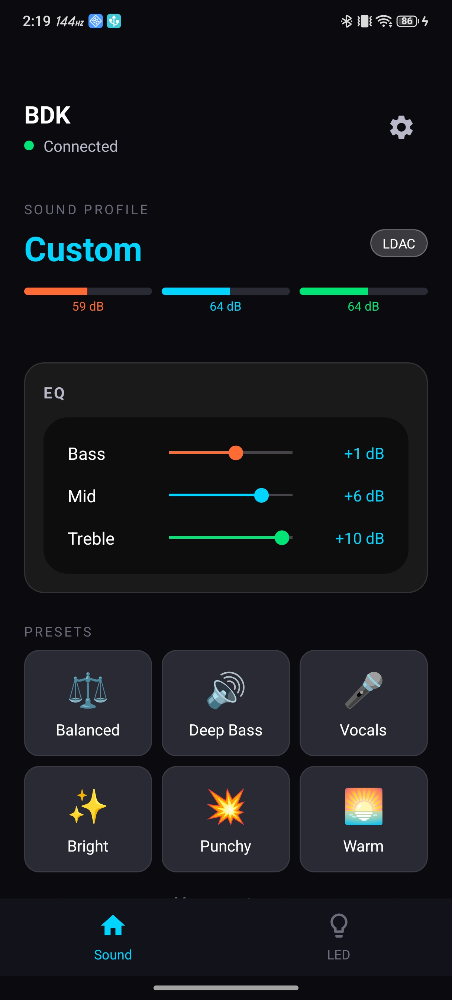
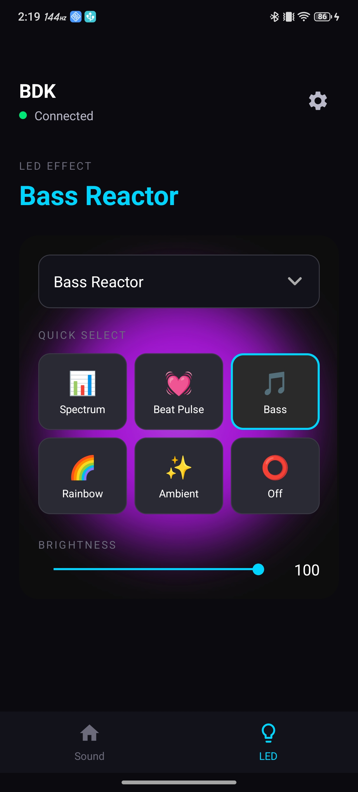
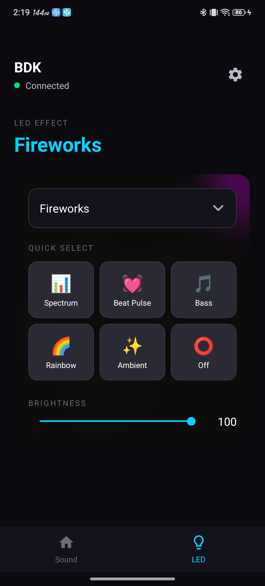
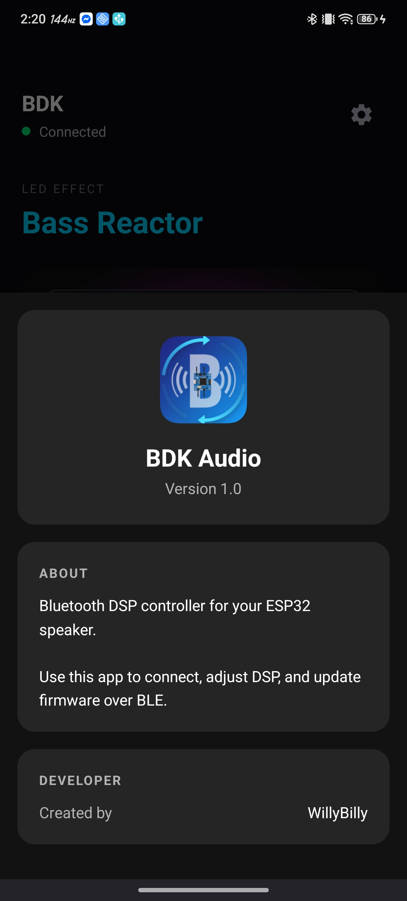
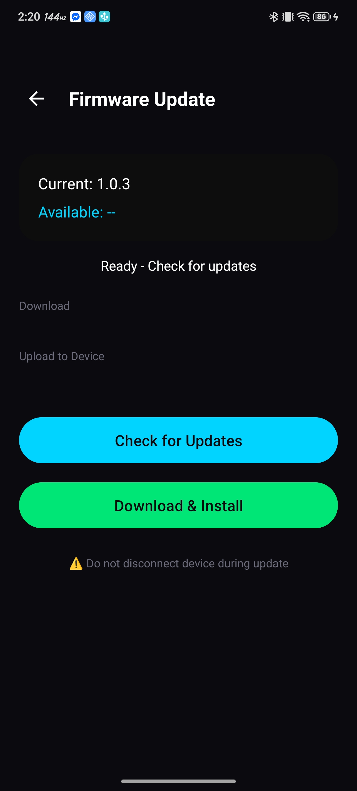
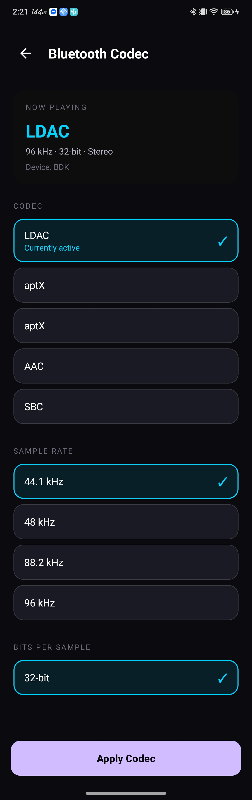

<p align="center">
  
  
  
  
</p>

<p align="center">
  <b>BDK Audio - Cross-Platform Companion App for ESP32 Bluetooth Speakers</b><br>
  <sub>Control DSP | LED Effects | Bluetooth Codecs | OTA Updates | Real-time Audio Meters</sub>
</p>

<p align="center">
  <i>Kotlin Multiplatform app for Android and iOS</i><br>
  <a href="https://github.com/WillyBilly06/ESP32-A2DP-SINK-WITH-CODECS-UPDATED">View ESP32 Firmware Project</a>
</p>

---

## Table of Contents

- [Overview](#overview)
- [Screenshots](#screenshots)
- [Features](#features)
- [Architecture](#architecture)
- [Requirements](#requirements)
- [Installation](#installation)
- [OTA Updates](#ota-updates)
- [BLE Protocol](#ble-protocol)
- [Project Structure](#project-structure)
- [Related Projects](#related-projects)
- [License](#license)

---

## Overview

BDK Audio is a cross-platform companion application built with Kotlin Multiplatform for controlling ESP32-based Bluetooth speakers. It provides a unified interface for adjusting DSP parameters, selecting LED visualization effects, monitoring real-time audio levels, and performing encrypted firmware updates over-the-air.

---

## Screenshots

<p align="center">
  
  &nbsp;&nbsp;&nbsp;&nbsp;
  
</p>

<p align="center">
  
  &nbsp;&nbsp;&nbsp;&nbsp;
  
</p>

<p align="center">
  
  &nbsp;&nbsp;&nbsp;&nbsp;
  
</p>

<p align="center">
  
  &nbsp;&nbsp;&nbsp;&nbsp;
  
</p>

<p align="center">
  
  &nbsp;&nbsp;&nbsp;&nbsp;
  
</p>

---

## Features

### Bluetooth Connectivity

| Feature | Description |
|:--------|:------------|
| BLE Scanning | Filter devices by service UUID |
| MTU Negotiation | Up to 517 bytes for fast OTA |
| Connection Monitoring | Real-time status updates |
| Multi-Device Support | Switch between speakers |
| Auto-Reconnect | Automatic reconnection on disconnect |
| Bluetooth State Detection | Auto-disconnect when BT disabled |

### Audio DSP Control

| Control | Range | Description |
|:--------|:------|:------------|
| Bass | -12 to +12 dB | 80 Hz center frequency |
| Mid | -12 to +12 dB | 1 kHz center frequency |
| Treble | -12 to +12 dB | 8 kHz center frequency |
| Bass Boost | On/Off | Hardware bass enhancement |
| EQ Bypass | On/Off | Bypass all DSP processing |
| Channel Flip | On/Off | Swap L/R channels |

### EQ Presets

| Preset | Bass | Mid | Treble |
|:-------|:----:|:---:|:------:|
| Flat | 0 | 0 | 0 |
| Bass Boost | +6 | 0 | 0 |
| Treble Boost | 0 | 0 | +6 |
| V-Shape | +4 | -2 | +4 |
| Warm | +3 | +1 | -2 |
| Bright | -1 | 0 | +4 |
| Vocal | -2 | +4 | +1 |
| Electronic | +5 | -1 | +3 |
| Acoustic | +2 | +2 | +3 |
| Rock | +4 | -1 | +3 |

### LED Effects (22 Modes)

Audio-reactive visualization effects for 16x16 WS2812B LED matrix:

| ID | Effect | ID | Effect |
|:--:|:-------|:--:|:-------|
| 0 | Spectrum Bars | 11 | Particle Burst |
| 1 | Beat Pulse | 12 | Kaleidoscope |
| 2 | Ripple | 13 | Frequency Spiral |
| 3 | Fire | 14 | Bass Reactor |
| 4 | Plasma | 15 | Meteor Shower |
| 5 | Matrix Rain | 16 | Breathing |
| 6 | VU Meter | 17 | DNA Helix |
| 7 | Starfield | 18 | Audio Scope |
| 8 | Wave | 19 | Bouncing Balls |
| 9 | Fireworks | 20 | Lava Lamp |
| 10 | Rainbow Wave | 21 | Ambient (static color) |

### LED Controls

| Parameter | Range | Description |
|:----------|:------|:------------|
| Brightness | 0-100% | Global LED brightness |
| Speed | 0-100% | Effect animation speed |
| Color 1 | RGB | Primary effect color |
| Color 2 | RGB | Secondary/gradient color |
| Gradient Type | 0-2 | Color blend mode |

### Bluetooth Codec Settings

Dedicated full-screen codec configuration with live feedback:

| Feature | Description |
|:--------|:------------|
| **Codec Selection** | SBC, AAC, aptX, aptX HD, LDAC |
| **Sample Rate** | 44.1 kHz, 48 kHz, 88.2 kHz, 96 kHz, 176.4 kHz, 192 kHz |
| **Bits Per Sample** | 16-bit, 24-bit, 32-bit |
| **Live Status** | Current codec info updates in real time |
| **Auto Permission** | Companion Device Manager association requested automatically on connect |

| Codec | Max Bitrate | Best For |
|:------|:-----------:|:---------|
| SBC | 328 kbps | Universal compatibility |
| AAC | 256 kbps | Apple devices |
| aptX | 352 kbps | Low latency |
| aptX HD | 576 kbps | High-definition audio |
| LDAC | 990 kbps | Hi-Res listening |

### Live Codec Monitoring

| Feature | Description |
|:--------|:------------|
| Bottom Status Badge | Live codec name, sample rate & bit depth on main screen |
| Device Info Sheet | Real-time codec updates without reopening |
| System Polling | 2.5s polling for devices without `CODEC_CONFIG_CHANGED` broadcast |

### Over-the-Air Updates

| Feature | Description |
|:--------|:------------|
| Encrypted Transfer | AES-256-CBC encryption |
| Fast BLE Protocol | Batched ACK (7 fast + 1 ACK) |
| Progress Tracking | Real-time KB transferred |
| Verification | CHECK command before finalize |
| Auto-Reboot | Automatic ESP32 restart on completion |

---

## Architecture

### Kotlin Multiplatform Structure

```
shared/               # Cross-platform code (Kotlin)
├── commonMain/       # Shared business logic
│   ├── BleUnifiedProtocol.kt  # BLE command/response protocol
│   ├── DeviceModels.kt        # Data models
│   ├── EqPresets.kt           # EQ preset definitions
│   └── LedEffects.kt          # LED effect definitions
├── androidMain/      # Android-specific implementations
└── iosMain/          # iOS-specific implementations

app/                  # Android app (Kotlin)
├── MainActivityRedesign.kt    # Main control UI + live codec badge
├── SettingsActivity.kt        # DSP toggles, navigation hub
├── CodecSettingsActivity.kt   # Full-screen codec config (codec / sample rate / bits)
├── CodecManager.kt            # Reflection-based A2DP codec read/write
├── DeviceInfoBottomSheet.kt   # Live-updating device & codec info sheet
├── ConnectionActivity.kt      # BLE scan & auto-connect
├── OtaActivity.kt             # OTA update screen
└── OtaDownloader.kt           # Google Drive integration

iosApp/               # iOS app (SwiftUI)
├── MainControlView.swift      # Main control UI
├── SettingsView.swift         # Settings screen
└── OtaView.swift              # OTA update screen
```

### BLE Protocol

The app uses a unified binary protocol with 3 BLE characteristics:

| Characteristic | UUID | Direction | Purpose |
|:---------------|:-----|:----------|:--------|
| CMD | `xxxx-b1xx` | Write | Send commands to ESP32 |
| STATUS | `xxxx-b2xx` | Notify | Receive status updates |
| METER | `xxxx-b3xx` | Notify | Real-time audio levels |

---

## Requirements

### Android

| Requirement | Value |
|:------------|:------|
| Min SDK | 26 (Android 8.0 Oreo) |
| Target SDK | 36 (Android 16) |
| BLE Support | Required |

### iOS

| Requirement | Value |
|:------------|:------|
| Min iOS | 15.0 |
| Device | iPhone/iPad with BLE |

### Permissions (Android)

| Permission | Purpose |
|:-----------|:--------|
| `BLUETOOTH_SCAN` | Scan for BLE devices (Android 12+) |
| `BLUETOOTH_CONNECT` | Connect to BLE devices (Android 12+) |
| `BLUETOOTH_PRIVILEGED` | Read A2DP codec status (system-signed apps) |
| `COMPANION_DEVICE_SETUP` | Companion Device Manager association |
| `ACCESS_FINE_LOCATION` | Required for BLE scanning |
| `BLUETOOTH` / `BLUETOOTH_ADMIN` | Legacy (Android 11 and below) |

---

## Installation

### From Source (Android)

```bash
git clone https://github.com/WillyBilly06/BDK-AUDIO-APP.git
cd BDK-AUDIO-APP
```

1. Open in Android Studio (Hedgehog or newer)
2. Sync Gradle dependencies
3. Connect Android device or start emulator
4. Build and run (`Shift+F10`)

### From Source (iOS)

```bash
cd iosApp
open BDKAudio.xcodeproj
```

1. Open in Xcode 15+
2. Select your development team
3. Build and run on device (BLE requires physical device)

### APK Installation

1. Download latest APK from Releases
2. Enable "Install from unknown sources" on Android
3. Install the APK

---

## OTA Updates

### Setting Up OTA

1. **Generate AES Key**
   ```bash
   cd tools
   python encrypt_firmware.py --generate-key
   ```

2. **Update Keys** in:
   - `tools/encrypt_firmware.py` (AES_KEY)
   - `recovery/main/recovery_main.cpp` (AES_KEY)
   - `app/.../OtaDownloader.kt` (AES_KEY)
   - iOS: `OtaView.swift` (aesKey)

3. **Encrypt Firmware**
   ```bash
   python encrypt_firmware.py build/bt_audio_sink.bin --version 1.1.0
   ```

4. **Upload to Google Drive**
   - Upload `ota_releases/1.1.0.enc` to Google Drive
   - Share with "Anyone with link"
   - Create `latest.txt` with: `1.1.0,<FILE_ID>`

5. **Update File IDs** in `OtaDownloader.kt`:
   ```kotlin
   private const val GDRIVE_LATEST_TXT_ID = "YOUR_LATEST_TXT_FILE_ID"
   ```

---

## BLE Protocol

### Command Format

All commands are binary packets:

```
[CMD_ID:1][PAYLOAD:N]
```

### Available Commands

| Command | ID | Payload | Description |
|:--------|:--:|:--------|:------------|
| SET_EQ | 0x10 | bass, mid, treble | Set EQ values |
| SET_EQ_PRESET | 0x11 | presetId | Apply preset |
| SET_CONTROL | 0x12 | flags | DSP toggles |
| SET_NAME | 0x13 | name[20] | Rename device |
| SET_LED | 0x20 | effect, brightness, speed, colors | Full LED config |
| SET_LED_EFFECT | 0x21 | effectId | Change effect only |
| SET_LED_BRIGHTNESS | 0x22 | brightness | Brightness only |
| OTA_BEGIN | 0x40 | size[4] | Start OTA |
| OTA_DATA | 0x41 | seq[2], data[N] | Firmware chunk |
| OTA_END | 0x42 | - | Finalize OTA |
| REQUEST_STATUS | 0x50 | - | Request full status |
| PING | 0xFF | - | Connection check |

---

## Project Structure

```
BDK-AUDIO-APP/
├── README.md
├── app/                    # Android app module
│   ├── src/main/
│   │   ├── java/com/example/myspeaker/
│   │   │   ├── MainActivityRedesign.kt
│   │   │   ├── SettingsActivity.kt
│   │   │   ├── CodecSettingsActivity.kt
│   │   │   ├── CodecManager.kt
│   │   │   ├── DeviceInfoBottomSheet.kt
│   │   │   ├── ConnectionActivity.kt
│   │   │   ├── OtaActivity.kt
│   │   │   ├── OtaDownloader.kt
│   │   │   └── ...
│   │   └── res/
│   │       ├── layout/
│   │       ├── drawable/
│   │       └── values/
│   └── build.gradle.kts
├── shared/                 # Kotlin Multiplatform shared code
│   ├── src/
│   │   ├── commonMain/kotlin/
│   │   ├── androidMain/kotlin/
│   │   └── iosMain/kotlin/
│   └── build.gradle.kts
├── iosApp/                 # iOS SwiftUI app
│   └── BDKAudio/
│       ├── Views/
│       ├── ViewModels/
│       └── Utilities/
└── screenshots/
```

---

## Related Projects

| Project | Description |
|:--------|:------------|
| [ESP32-A2DP-SINK-WITH-CODECS-UPDATED](https://github.com/WillyBilly06/ESP32-A2DP-SINK-WITH-CODECS-UPDATED) | ESP32 firmware (ESP-IDF 5.5.2) |
| [esp32-a2dp-sink-with-LDAC-APTX-AAC](https://github.com/WillyBilly06/esp32-a2dp-sink-with-LDAC-APTX-AAC) | Original ESP-IDF 5.3 version |

---

## Developer

Created by **WillyBilly**

---

## License

This project is proprietary software. All rights reserved.
